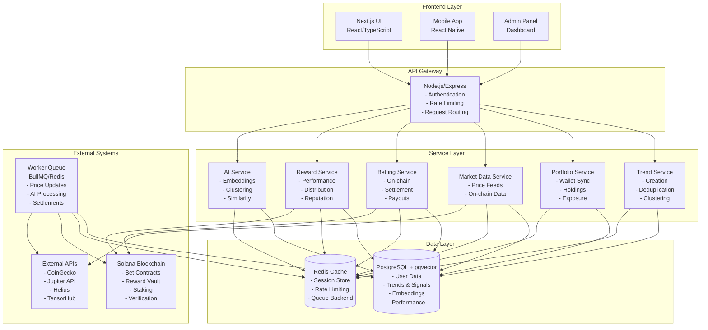
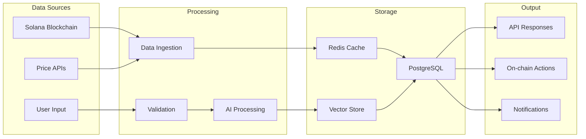
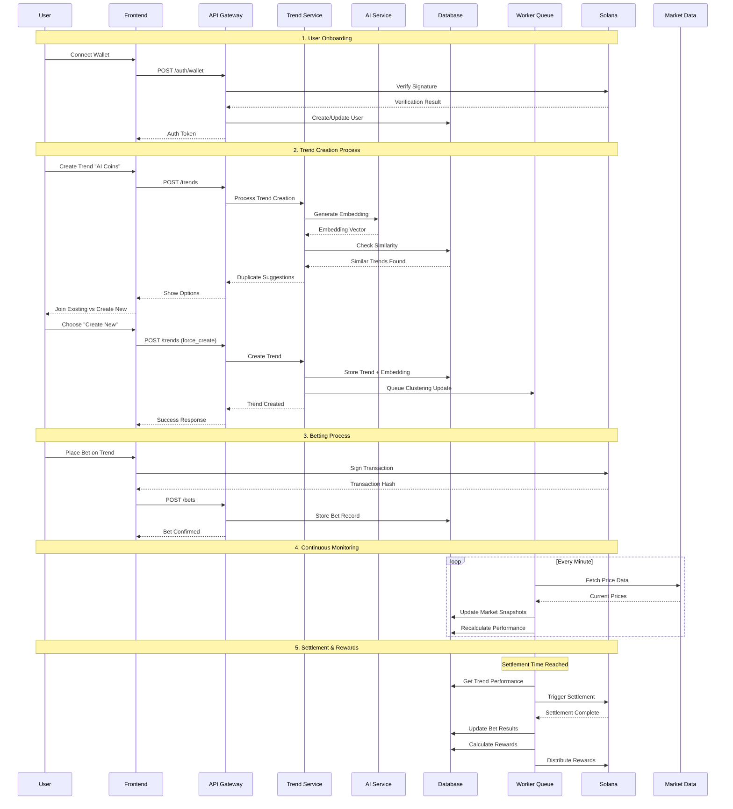
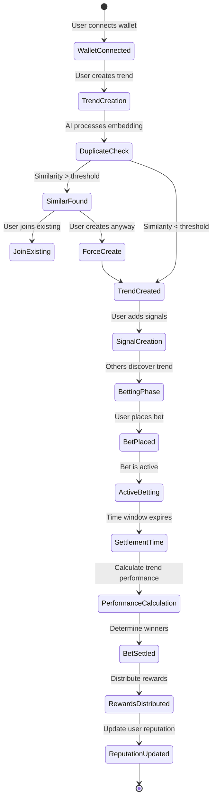

# TREND Platform - Functional Architecture

## Overview

The TREND platform is a decentralized crypto analytics and prediction platform that combines real-time market data, community intelligence, and AI-powered trend analysis. This document outlines the complete functional architecture, data flows, and system mechanics that power the platform.

---

## 🧠 1. Conceptual Core — the "Ecosystem Brain"

The platform operates as **three interconnected subsystems**:

### 1. **Data Layer (Reality)**
- Pulls real data from Solana blockchain, price oracles, and market APIs
- Provides the ground truth for trend validation and performance measurement
- Continuously updated via background workers and real-time feeds

### 2. **Community Layer (Intelligence)**
- Users submit signals, trends, and predictions
- Community voting, betting, and reputation systems
- Crowdsourced intelligence that drives platform value

### 3. **Logic Layer (Judgment)**
- Backend services + AI processing for validation and analysis
- Deduplication, clustering, and ranking algorithms
- Economic enforcement through smart contracts

**Continuous Feedback Loop:**
```
Real Data → User Signals → AI Processing → Trend Validation → Market Performance → Rewards → Enhanced Signals
```

---

## ⚙️ 2. System Architecture Overview

### High-Level Architecture Diagram



### Data Flow Architecture



---

## 🧩 3. Data Model & Entity Relationships

### Core Entities

| Entity | Description | Key Relationships |
|--------|-------------|-------------------|
| **User** | Wallet address, reputation, XP, token balance | `1:N` signals, bets, rewards |
| **Trend** | Thematic cluster (e.g., "AI Coins") | `1:N` signals, coins, bets |
| **Signal** | Individual insight proposed by user | `N:1` user, `N:1` trend |
| **Coin** | Token metadata and price data | `N:M` trends via mappings |
| **Bet** | User stake on trend performance | `N:1` user, `N:1` trend |
| **Reward** | Earned tokens based on performance | `N:1` user |
| **Embedding** | 1536-D vector for similarity | `1:1` trend/signal |
| **MarketSnapshot** | Price data at specific timestamps | Used for performance calc |

### Database Schema (Simplified)

```sql
-- Core Tables
users (id, wallet_address, reputation_score, xp, TREND_balance, created_at)
trends (id, title, description, creator_id, theme_id, performance, confidence, created_at)
signals (id, trend_id, user_id, claim, coins, result, accuracy_score, created_at)
coins (id, symbol, name, mint_address, coingecko_id, created_at)
trend_coins (trend_id, coin_id, weight)
bets (id, trend_id, user_id, side, stake_amount, settlement_date, status, tx_hash)
rewards (id, user_id, type, amount, currency, earned_at, description)

-- AI & Performance
embeddings (id, entity_type, entity_id, vector, created_at)
market_snapshots (id, coin_id, price_usd, market_cap, timestamp)
trend_performance (trend_id, timeframe, start_price, end_price, return_pct, calculated_at)
```

---

## 🧮 4. Functional Module Breakdown

### 🧱 A. Trend Creation & Deduplication

**Frontend Flow:**
1. User types new trend title + description
2. UI sends to backend with metadata
3. Backend computes embedding via AI service
4. Compares with existing embeddings using cosine similarity
5. If similarity > threshold (0.85), returns similar trends
6. Frontend displays suggestions with "Join existing" vs "Create new" options

**Backend Logic:**
```typescript
async createTrend(data: CreateTrendRequest) {
  // 1. Generate embedding
  const embedding = await aiService.generateEmbedding(data.title + " " + data.description);
  
  // 2. Check for duplicates
  const similarTrends = await vectorDB.findSimilar(embedding, { threshold: 0.85 });
  
  if (similarTrends.length > 0) {
    return { 
      status: 'duplicate_found', 
      suggestions: similarTrends,
      similarity_scores: similarTrends.map(t => t.similarity)
    };
  }
  
  // 3. Create new trend
  const trend = await db.trends.create({
    ...data,
    embedding,
    initial_score: 0,
    status: 'pending_review'
  });
  
  // 4. Queue clustering update
  await queue.add('update-clustering', { trendId: trend.id });
  
  return { status: 'created', trend };
}
```

**Worker Tasks:**
- Asynchronous embedding calculation
- Clustering analysis (groups semantically similar trends)
- Caching similarity matrix in Redis

### 💰 B. Portfolio Tracking

**Frontend Flow:**
1. User connects Solana wallet
2. Frontend sends wallet public key to backend
3. Backend fetches token balances and calculates USD values
4. Matches holdings to trend exposures
5. Returns computed portfolio structure

**Backend Logic:**
```typescript
async syncPortfolio(walletAddress: string) {
  // 1. Fetch token balances from Solana
  const balances = await solanaService.getTokenBalances(walletAddress);
  
  // 2. Get USD prices
  const prices = await marketDataService.getPrices(balances.map(b => b.mint));
  
  // 3. Calculate USD values
  const holdings = balances.map(balance => ({
    ...balance,
    usd_value: balance.amount * prices[balance.mint]?.usd || 0
  }));
  
  // 4. Calculate trend exposures
  const exposures = await calculateTrendExposures(holdings);
  
  // 5. Cache result
  await redis.setex(`portfolio:${walletAddress}`, 600, JSON.stringify({
    total_value: holdings.reduce((sum, h) => sum + h.usd_value, 0),
    holdings,
    exposures,
    last_synced: new Date().toISOString()
  }));
  
  return { holdings, exposures, total_value };
}
```

**Performance Optimizations:**
- Cache portfolio data for 10 minutes
- Incremental updates for price changes
- Background worker updates every 5 minutes

### 📈 C. Market Data & Trend Performance

**Performance Calculation Formula:**
```typescript
function calculateTrendPerformance(trendId: string, timeframe: string) {
  const trend = await db.trends.findById(trendId);
  const coins = await db.trendCoins.findByTrendId(trendId);
  
  const performances = await Promise.all(
    coins.map(async (coin) => {
      const startPrice = await getPriceAtTime(coin.id, trend.created_at);
      const currentPrice = await getCurrentPrice(coin.id);
      return (currentPrice / startPrice - 1) * coin.weight;
    })
  );
  
  return performances.reduce((sum, perf) => sum + perf, 0) / performances.length;
}
```

**Data Sources:**
- **CoinGecko API**: Primary price data
- **Jupiter API**: Solana-specific token prices
- **Helius**: On-chain data and token metadata
- **TensorHub**: NFT and token analytics

**Caching Strategy:**
- Redis stores `trend:<id>:performance` with 1-minute TTL
- Background worker updates every minute
- Fallback to database if cache miss

### 💡 D. AI Similarity & Clustering

**Embedding Generation:**
```typescript
async generateEmbedding(text: string): Promise<number[]> {
  const response = await openai.embeddings.create({
    model: "text-embedding-3-small",
    input: text,
    encoding_format: "float"
  });
  
  return response.data[0].embedding; // 1536 dimensions
}
```

**Clustering Algorithm:**
```typescript
async clusterTrends() {
  const trends = await db.trends.findAll();
  const embeddings = await db.embeddings.findByEntityType('trend');
  
  // Use HDBSCAN or similar clustering algorithm
  const clusters = await clusteringService.cluster(embeddings, {
    min_cluster_size: 3,
    min_samples: 2,
    metric: 'cosine'
  });
  
  // Update trend cluster assignments
  for (const [trendId, clusterId] of clusters) {
    await db.trends.update(trendId, { cluster_id: clusterId });
  }
}
```

**Similarity Search:**
```typescript
async findSimilarTrends(embedding: number[], limit: number = 5) {
  const query = `
    SELECT t.*, 1 - (e.vector <=> $1) as similarity
    FROM trends t
    JOIN embeddings e ON e.entity_id = t.id
    WHERE e.entity_type = 'trend'
    ORDER BY e.vector <=> $1
    LIMIT $2
  `;
  
  return await db.query(query, [embedding, limit]);
}
```

### 🧩 E. Betting System (On-Chain)

**Smart Contract Architecture:**
```rust
// Solana Program (Anchor)
#[program]
pub mod bet_pool {
    use super::*;
    
    pub fn create_bet(
        ctx: Context<CreateBet>,
        trend_id: String,
        side: BetSide,
        stake_amount: u64,
        timeframe: u64,
    ) -> Result<()> {
        // 1. Transfer tokens to escrow
        // 2. Create bet account
        // 3. Set settlement conditions
    }
    
    pub fn settle_bet(ctx: Context<SettleBet>) -> Result<()> {
        // 1. Check if settlement time reached
        // 2. Fetch trend performance from oracle
        // 3. Determine winners
        // 4. Distribute payouts
    }
}
```

**Frontend Integration:**
```typescript
async placeBet(trendId: string, side: 'up' | 'down', amount: number) {
  // 1. Create bet instruction
  const instruction = await betPoolProgram.methods
    .createBet(trendId, side, new BN(amount), timeframe)
    .accounts({
      betAccount: betAccountPDA,
      user: wallet.publicKey,
      escrow: escrowAccount,
      tokenMint: TREND_MINT,
    })
    .instruction();
  
  // 2. Send transaction
  const tx = new Transaction().add(instruction);
  const signature = await wallet.sendTransaction(tx, connection);
  
  // 3. Wait for confirmation
  await connection.confirmTransaction(signature);
  
  // 4. Update backend
  await api.post('/bets', {
    trend_id: trendId,
    side,
    stake_amount: amount,
    tx_hash: signature
  });
}
```

**Settlement Worker:**
```typescript
async settleBets() {
  const activeBets = await db.bets.findActive();
  
  for (const bet of activeBets) {
    if (bet.settlement_date <= new Date()) {
      // 1. Fetch trend performance
      const performance = await calculateTrendPerformance(bet.trend_id);
      
      // 2. Determine outcome
      const won = (bet.side === 'up' && performance > 0) || 
                  (bet.side === 'down' && performance < 0);
      
      // 3. Trigger smart contract settlement
      await betPoolProgram.methods
        .settleBet(bet.tx_hash)
        .rpc();
      
      // 4. Update database
      await db.bets.update(bet.id, {
        status: 'settled',
        result: won ? 'win' : 'loss',
        performance
      });
    }
  }
}
```

### 🎁 F. Rewards & Reputation System

**Reputation Calculation:**
```typescript
function calculateReputation(userId: string): number {
  const signals = db.signals.findByUserId(userId);
  const bets = db.bets.findByUserId(userId);
  
  const accuracyScore = signals.reduce((sum, signal) => {
    return sum + (signal.result === 'correct' ? 1 : 0);
  }, 0) / signals.length;
  
  const betWinRate = bets.reduce((sum, bet) => {
    return sum + (bet.result === 'win' ? 1 : 0);
  }, 0) / bets.length;
  
  return Math.round(
    (accuracyScore * 50) + 
    (betWinRate * 30) + 
    (signals.length * 0.1) + 
    (bets.length * 0.05)
  );
}
```

**Reward Distribution:**
```typescript
async distributeRewards() {
  const users = await db.users.findAll();
  
  for (const user of users) {
    const rewards = await calculateUserRewards(user.id);
    
    if (rewards.total > 0) {
      // 1. Create reward record
      await db.rewards.create({
        user_id: user.id,
        type: 'performance',
        amount: rewards.total,
        currency: 'TREND',
        description: `Performance reward for ${rewards.period}`
      });
      
      // 2. Transfer tokens (or mark as pending)
      await rewardVault.transfer(user.wallet_address, rewards.total);
      
      // 3. Update user balance
      await db.users.updateBalance(user.id, rewards.total);
    }
  }
}
```

---

## 🧩 5. Inter-Module Data Flow

### Complete User Journey Flow



### System State Transitions



---

## 🔒 6. Security & Validation Layers

### Authentication & Authorization
```typescript
// Wallet-based authentication
async authenticateWallet(signature: string, message: string, publicKey: string) {
  const isValid = await solanaService.verifySignature(signature, message, publicKey);
  if (!isValid) throw new Error('Invalid signature');
  
  const user = await db.users.findByWallet(publicKey);
  return user ? user : await db.users.create({ wallet_address: publicKey });
}
```

### Rate Limiting
```typescript
// Redis-based rate limiting
const rateLimiter = new RateLimiter({
  store: redis,
  keyPrefix: 'rate_limit',
  points: 10, // requests
  duration: 60, // per 60 seconds
});

async function checkRateLimit(identifier: string) {
  const result = await rateLimiter.consume(identifier);
  if (result.remainingPoints < 0) {
    throw new Error('Rate limit exceeded');
  }
}
```

### Input Validation
```typescript
// Zod schema validation
const CreateTrendSchema = z.object({
  title: z.string().min(3).max(100),
  description: z.string().min(10).max(500),
  coins: z.array(z.string()).min(1).max(10),
  theme_id: z.string().min(1)
});
```

### Anti-Spam Measures
- Minimum stake requirement for frequent signalers
- Reputation-based posting limits
- Duplicate detection with similarity thresholds
- IP and wallet-based rate limiting

---

## ⚡ 7. Performance Optimizations

| Component | Optimization Strategy | Implementation |
|-----------|----------------------|----------------|
| **Portfolio Sync** | Cache + incremental updates | Redis cache with 10min TTL |
| **Trends List** | Pre-computed snapshots | Redis refresh every 1min |
| **Similarity Search** | Vector indexing | pgvector with HNSW index |
| **Market Data** | Aggregated microservice | Single service hitting APIs |
| **Bet Settlement** | Event-driven processing | On-chain event listeners |
| **AI Processing** | Async workers | BullMQ queue with priority |

### Caching Strategy
```typescript
// Multi-layer caching
const cacheStrategy = {
  L1: 'In-memory (Node.js)', // Hot data, 1-5 seconds
  L2: 'Redis', // Warm data, 1-10 minutes  
  L3: 'Database', // Cold data, persistent
};

// Cache invalidation patterns
const invalidationRules = {
  'trend:*': 'Update on new signals',
  'portfolio:*': 'Update on wallet activity',
  'performance:*': 'Update on price changes',
  'similarity:*': 'Update on new trends'
};
```

### Database Optimization
```sql
-- Indexes for performance
CREATE INDEX CONCURRENTLY idx_trends_created_at ON trends(created_at);
CREATE INDEX CONCURRENTLY idx_signals_user_trend ON signals(user_id, trend_id);
CREATE INDEX CONCURRENTLY idx_bets_settlement ON bets(settlement_date) WHERE status = 'active';
CREATE INDEX CONCURRENTLY idx_embeddings_vector ON embeddings USING hnsw (vector vector_cosine_ops);

-- Partitioning for large tables
CREATE TABLE market_snapshots_2024 PARTITION OF market_snapshots
FOR VALUES FROM ('2024-01-01') TO ('2025-01-01');
```

---

## 🔗 8. Solana Integration Architecture

### Smart Contract Programs

| Program | Purpose | Key Functions |
|---------|---------|---------------|
| **BetPool** | Betting escrow and settlement | `create_bet`, `settle_bet`, `claim_payout` |
| **RewardVault** | Token distribution | `distribute_rewards`, `claim_rewards` |
| **StakeModule** | Signal boosting | `stake_tokens`, `unstake_tokens` |
| **OracleAggregator** | Price feeds | `update_prices`, `get_price` |

### On-Chain Data Flow
```typescript
// Event listening for real-time updates
const program = new Program(BetPoolProgram, provider);

program.addEventListener('BetCreated', (event) => {
  // Update backend database
  updateBetStatus(event.betId, 'active');
});

program.addEventListener('BetSettled', (event) => {
  // Trigger reward calculation
  calculateRewards(event.betId, event.outcome);
});
```

### Cross-Program Invocations
```rust
// Reward distribution after bet settlement
pub fn distribute_rewards(ctx: Context<DistributeRewards>) -> Result<()> {
    let reward_vault = &mut ctx.accounts.reward_vault;
    let user_account = &mut ctx.accounts.user_account;
    
    // Calculate reward amount
    let reward_amount = calculate_reward_amount(&ctx.accounts.bet_account)?;
    
    // Transfer tokens
    reward_vault.transfer_tokens(user_account, reward_amount)?;
    
    Ok(())
}
```

---

## 🧠 9. System Integration Summary

### Data Flow Architecture
1. **Real-time Data Ingestion**: Market data flows continuously from external APIs
2. **User Interaction Layer**: Frontend captures user actions and wallet signatures
3. **Processing Layer**: Backend services validate, process, and store data
4. **AI Intelligence Layer**: Machine learning models analyze patterns and similarities
5. **Blockchain Layer**: Smart contracts enforce economic rules and distribute rewards
6. **Feedback Loop**: Performance data feeds back into reputation and reward systems

### Key Integration Points
- **Wallet ↔ Backend**: Signature-based authentication
- **Backend ↔ Blockchain**: Transaction monitoring and event listening
- **AI ↔ Database**: Vector similarity and clustering
- **Workers ↔ APIs**: Scheduled data synchronization
- **Cache ↔ Database**: Performance optimization layer

### Scalability Considerations
- **Horizontal Scaling**: Microservices architecture allows independent scaling
- **Database Sharding**: Partition large tables by time and user segments
- **CDN Integration**: Static assets and API responses cached globally
- **Load Balancing**: Multiple API instances behind load balancer
- **Queue Scaling**: Worker queues can scale based on demand

---

## 🚀 10. Deployment & Monitoring

### Infrastructure Requirements
- **API Servers**: 3+ instances for high availability
- **Database**: PostgreSQL with read replicas
- **Cache**: Redis cluster for session and data caching
- **Workers**: Dedicated worker nodes for background processing
- **Blockchain**: Solana RPC endpoints (multiple providers)

### Monitoring & Observability
```typescript
// Application metrics
const metrics = {
  api: {
    response_time: 'histogram',
    request_count: 'counter',
    error_rate: 'gauge'
  },
  blockchain: {
    transaction_confirmation_time: 'histogram',
    settlement_success_rate: 'gauge'
  },
  ai: {
    embedding_generation_time: 'histogram',
    similarity_search_time: 'histogram'
  }
};
```

### Health Checks
- Database connectivity and query performance
- Redis cache availability and response time
- Solana RPC endpoint health
- External API availability (CoinGecko, Jupiter)
- Worker queue processing rates

This architecture provides a robust, scalable foundation for the TREND platform, ensuring high performance, security, and user experience while maintaining the decentralized nature of the crypto ecosystem.
